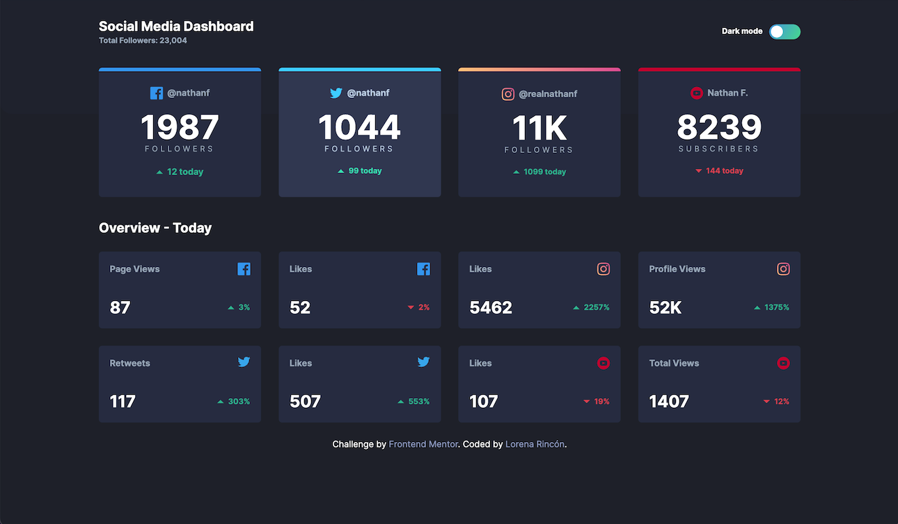
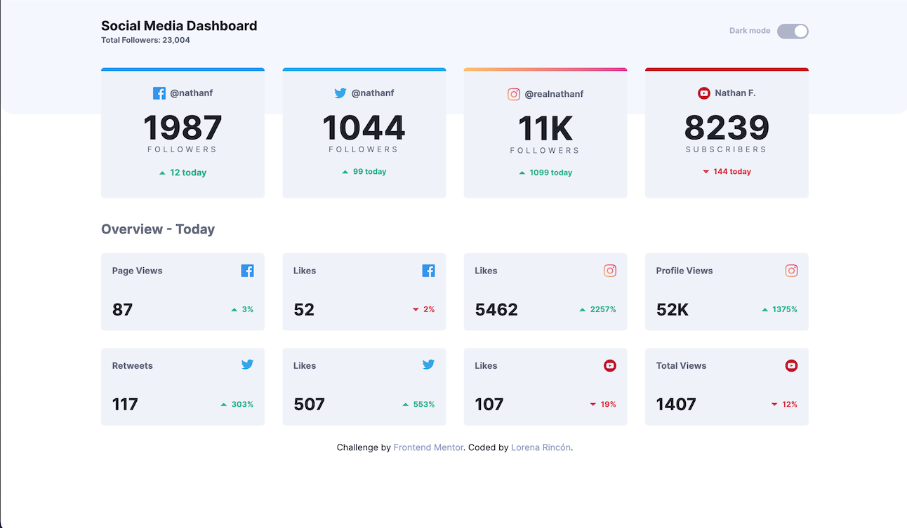

# Frontend Mentor - Social media dashboard with theme switcher solution

This is a solution to the [Social media dashboard with theme switcher challenge on Frontend Mentor](https://www.frontendmentor.io/challenges/social-media-dashboard-with-theme-switcher-6oY8ozp_H). Frontend Mentor challenges help you improve your coding skills by building realistic projects.

## Table of contents

- [Overview](#overview)
  - [The challenge](#the-challenge)
  - [Screenshot](#screenshot)
  - [Links](#links)
- [My process](#my-process)
  - [Built with](#built-with)
  - [What I learned](#what-i-learned)
  - [Useful resources](#useful-resources)
- [Author](#author)

## Overview

### The challenge

Users should be able to:

- View the optimal layout for the site depending on their device's screen size
- See hover states for all interactive elements on the page
- Toggle color theme to their preference

### Screenshots

## Dark Mode



## Light Mode



### Links

- Solution URL: [GitHub Repository](https://github.com/lorenacrincon/social-media-dashboard-with-theme-switcher)
- Live Site URL: [Click here!](https://lorenacrincon.github.io/social-media-dashboard-with-theme-switcher/)

## My process

### Built with

- Semantic HTML5 markup
- CSS custom properties
- Flexbox
- CSS Grid
- Mobile-first workflow
- [React](https://reactjs.org/) - JS library
- [Vite.js](https://vitejs.dev/)
- [Tailwind css](https://tailwindcss.com/) - For styles

### What I learned

In this challenge, I learned how to customize classes in Tailwind from the tailwind.config.js file. I understood how Tailwind's dark mode works and practiced grid layout.

```html
<article
  className="light-card-bg dark:bg-slate-700 p-7 rounded-md shadow-slate-50 border-t-6 border-blue-500 hover:brightness-125"
>
  <ul className="flex items-center justify-center text-center gap-2">
    <li>
      
    </li>
    <li className="font-bold gray-blue-text dark:text-slate-400">@nathanf</li>
  </ul>
  <h2
    className="blue-dark-text dark:text-white font-bold text-6xl text-center my-5"
  >
    1987{" "}
    <span
      className="tracking-widest gray-blue-text  text-sm block font-normal dark:text-slate-400"
    >
      FOLLOWERS
    </span>
  </h2>

  <p
    className="lime-text font-bold text-md text-center flex items-center justify-center"
  >
    
    12 today
  </p>
</article>
```

```css
.checkbox:checked + .label .ball {
  transform: translateX(-25px);
}

.checkbox:checked + .label {
  background: linear-gradient(120deg, hsl(210, 78%, 56%), hsl(146, 68%, 55%));
}
```

```js
const [darkMode, setDarkMode] = useState(true); // Cambio a true

useEffect(() => {
  const body = document.querySelector("body");

  if (darkMode) {
    body.classList.add("dark");
  } else {
    body.classList.remove("dark");
  }
}, [darkMode]);

const toggleTheme = () => {
  setDarkMode(!darkMode);
};
```

### Useful resources

- [Youtube Tutorial](https://www.youtube.com/watch?v=VylXkPy-MIc) - This tutorial helped me a lot to undestrand how tailwind css dark mode works.

## Author

- GitHub Profile - [Lorena Rincón](https://github.com/lorenacrincon)
- Frontend Mentor - [@lorenacrincon](https://www.frontendmentor.io/profile/lorenacrincon)
- Linkedin Profile - [Lorena Rincón](https://www.linkedin.com/in/lore-rincon)
